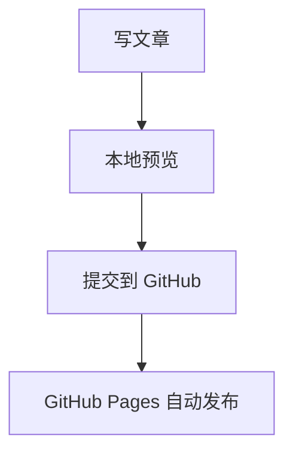

欢迎来到 `小镇梦想家`。

这个博客已经基于 `Hexo`、`Butterfly` 和 `GitHub Pages` 配好了基础结构，后面可以直接开始写文章。

## 目前已经启用

- 本地搜索
- 深色模式切换
- 归档 / 分类 / 标签页
- 文章目录
- 图片放大
- Mermaid 图表

## 写作示例

```bash
npx hexo new "我的第一篇技术文章"
```



后续如果你想继续补评论系统、友链页、统计分析或自定义域名，可以在这个基础上继续扩展。
